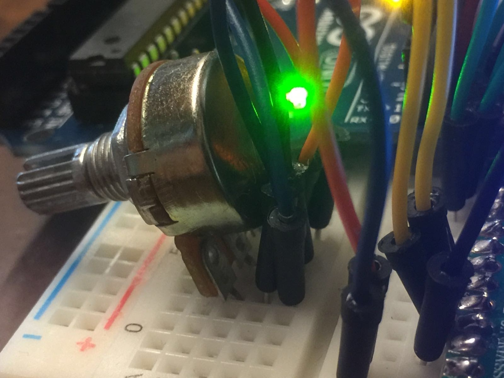

# A workshop on Arduino for creative coders

## Workshop Goals
- Introduce participants to Arduino and its capabilities
- Teach the basics of programming and electronics using Arduino
- Enable participants to build simple projects using Arduino
- Explore creative ways of using Arduinos for exhibits
- Build a protoype for creative purposes

## Workshop Topics

1. Introduction to Arduino
    - What is Arduino?
    - Arduino boards and components
    - Setting up the Arduino IDE

2. Arduino Programming Basics
    - Understanding the Arduino programming language
    - Writing and uploading your first Arduino sketch
    - Working with variables, data types, and control structures

3. Hardware Components
    - Introduction to common electronic components used with Arduino
    - Understanding resistors, LEDs, sensors, and motors
    - Connecting and using these components with Arduino

4. Interfacing
    - Digital and analog I/O
    - Controlling LEDs, motors, and other actuators
    - Serial communication with the Computer

5. Building a Prototype
    - Choosing a sensor and an actuator
    - Mapping inputs to outputs
    - demonstration

## Workshop Requirements
- Arduino board (e.g., Arduino Uno, Arduino Nano)
- USB cable for connecting Arduino to the computer
- Breadboard and jumper wires
- Basic electronic components (e.g., resistors, LEDs, sensors)
- Computer with Arduino IDE installed

## Workshop Duration
The workshop is designed to be completed in 4 hours, including hands-on activities and project development.

